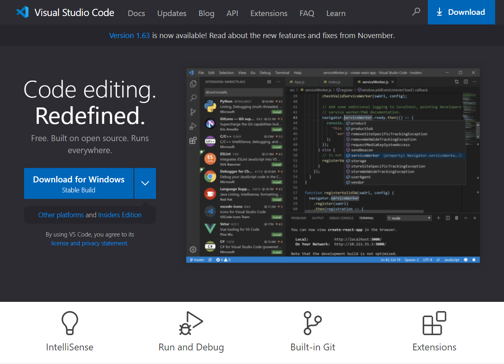
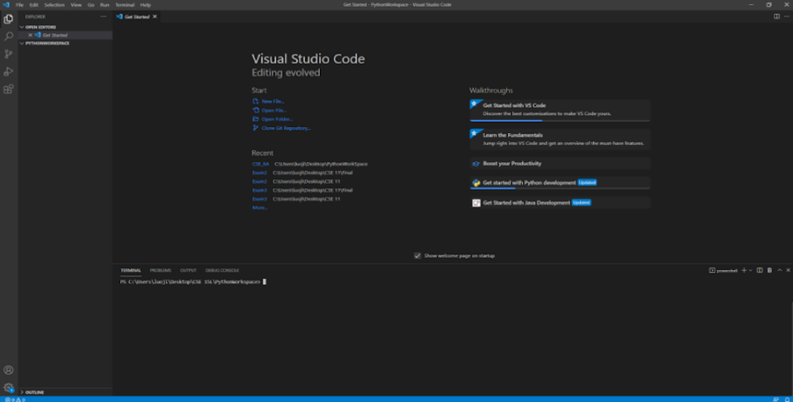
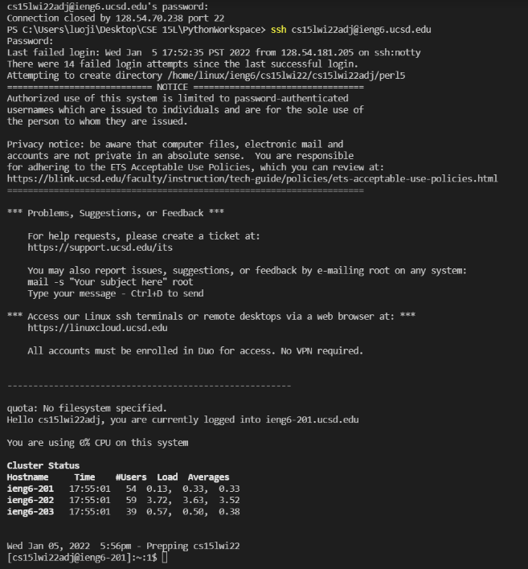
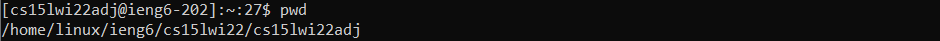
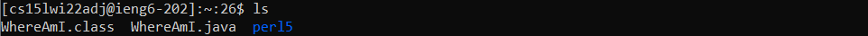
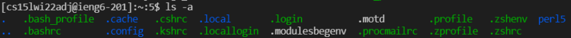
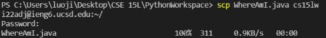
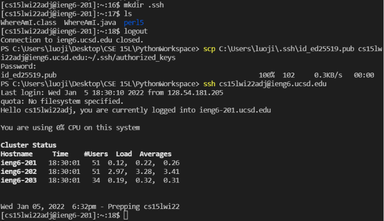
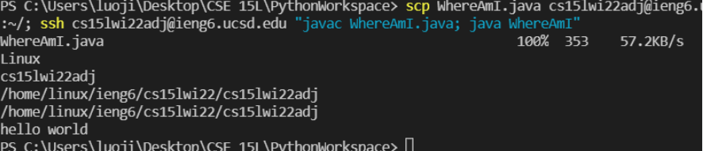

# Week 2 Lab Report
Hope this week is going well for you!

## 1. **Installing VScode**

You can download Visual Sutdio Code by clicking [here](https://code.visualstudio.com/). Please follow all instructions online accordingly. 

After open your VScode, it should look 
like this:

---

## 2. **Remotely Connecting**

In order to connect to the remote server, we need to first download and install OpenSSH .By clicking [here](https://sdacs.ucsd.edu/~icc/index.php), we need to first find the specific course account. 

After entering `$ ssh cs15lwi22adj@ieng6.ucsd.edu`, I enter my password of this account. Then, the terminal should look like this, meaning that I have successfully connected to the remote server:

---

## **3. Trying Some Commands**

Once we have logged into our account, we can try to run some linux commands on the server.

`pwd` means to display the current path

`ls` means to list files under the current path.

`ls -a` means to list all files under the current path

---

## **4. Moving Files with `scp`**

`scp` means to securely move files from the client to the server.
Create a file named `WhereAmI.java` on your computer first, then run the command `scp WhereAmI.java cs15lwi22adj@ieng6.ucsd.edu:~/` 
You will enter your password for logging in.

Then, you can use `ls` to see if the file is on the server.

---

## **5. Setting an SSH Key**
By setting an SSH key, we can log in the server without entering the password every time. 
Since I am a Windows user, I first entered `ssh-keygen -t ed25519` in PowerShell, so I get a public/private key pair (the .pub file is the public key). 

After doing that, I make a directory called `.ssh` on the server by entering `mkdir .ssh`. Then, I upload the public key (the file ends with .pub) to the directory that I just created. Now I can log in the server without entering my password!

---

## **6. Optimizing Remote Running**
I integrate some commands together so that I can make a local edit to WhereAmI.java, then copy it to the remote server and run it in one line of command: `scp WhereAmI.java cs15lwi22adj@ieng6.ucsd.edu:~/; ssh cs15lwi22adj@ieng6.ucsd.edu "javac WhereAmI.java; java WhereAmI`

